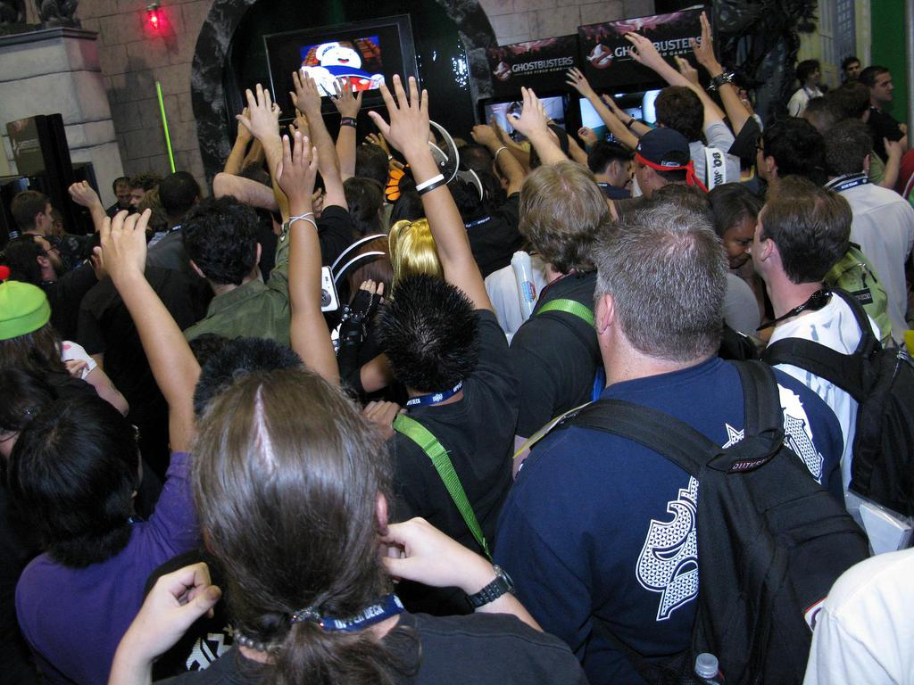
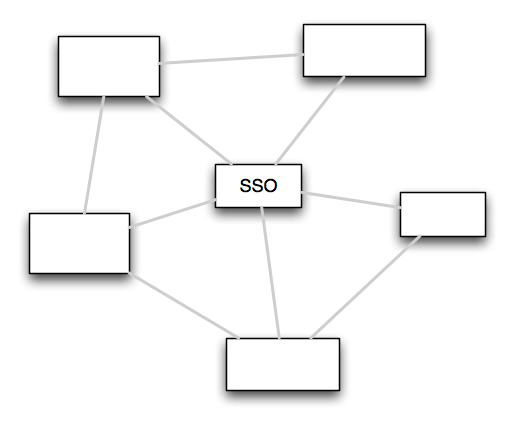

!SLIDE
# Services
# サービス
## aka SOA
## 別名 SOA

!SLIDE top fullscreen light

# Who knows SOA?
# SOAをご存知ですか？
ducdigital

!SLIDE bottom fullscreen light

# Who uses SOA?
# SOAをお使いですか？
colorblindpicaso

!SLIDE fullscreen

headlouse

!SLIDE
# Single Responsibility Principle
# 単一責任の原則
## aka The Unix Philosophy
## 別名 UNIXの精神
## do one thing and do it well
## たった一つの事を上手にやる

!SLIDE
# Smaller Code Bases
# 少ないコード

!SLIDE
# Each piece can be deployed separately
# それぞれの部品を別々にデプロイ出来る

!SLIDE
# Different teams can work on different services
# 複数のチームが異るサービスを開発できる

!SLIDE
# Engine Yard Architecture
# 弊社 Engine Yard の例

!SLIDE
# But how do we test?
# でもどうやってテストする？

!SLIDE larger
# Well...
# うーん…

!SLIDE fullscreen bottom larger

# It's hard
# 難しいです
coda2

